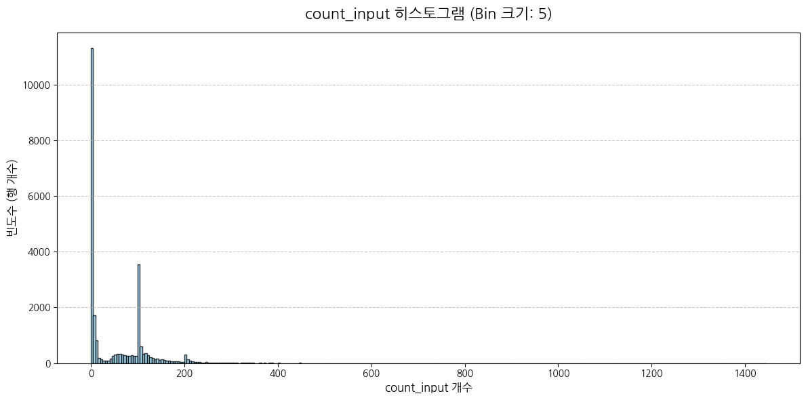
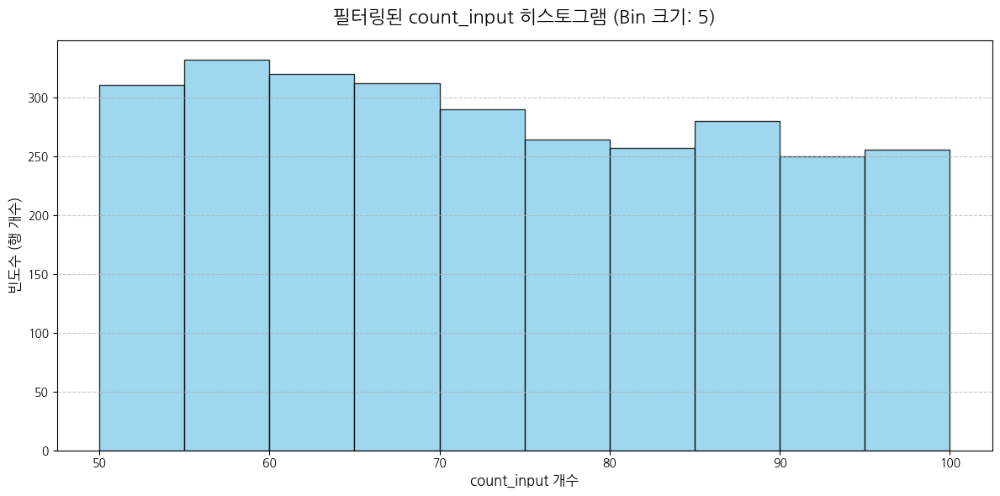

# TACO 데이터셋 기반 알고리즘 문제 변형 실험

## 실험 환경

- **컨테이너**: Docker (Linux)
- **런타임**: Jupyter Notebook (Python 3.11)

## 노트북 목록

| 파일 | 설명 |
|---|---|
| `1) research full_dataset.ipynb` | TACO 전체 데이터셋 탐색 및 통계 분석 |

## 분석 결과

### a.png — count_input 전체 분포

분포가 극단적으로 우편향(right-skewed). 대부분의 문제가 TC 20개 미만에 집중되며, 100 근처에 두 번째 소규모 피크 존재. TC 수 기준 하한 필터의 필요성 확인.

### b.png — count_input 50~99 구간 탐색

50~99 구간 내 문제들은 약 250~335개/bin 수준으로 균일하게 분포. 해당 범위가 필터 기준으로 타당함을 확인. 단, 팀 논의 결과 이러한 사실을 이후 파이프라인에 직접 반영하지는 않을 것으로 결정.
